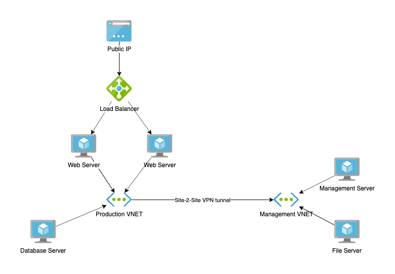

# Challenge

Refer to the diagram below.

- Configure Networking:
  - Deploy two VNETs - one for Production and one for Management
  - Establish a Site-2-Site tunnel between both networks
- Deploy the Management Stack which consists of two Windows Virtual Machines:
  - A management host which you will use to configure all other VMs
  - A file server where you can host application binaries and other tools (create a single  SMB file share which can be accessed from other servers)
- Deploy the Production Stack which consists of three Windows Virtual Machines
  - Two web servers behind a load balancer (perform a vanilla installation of IIS on Windows)
  - A database server (install MS SQL Server Express with default settings)
- Configure connectivity requirements (see below) and test
- Configure Azure File Sync for the file share hosted on the file server which is a part of the management stack.
- Configure backup for the virtual machines which are a part of the production stack.

The following connectivity requirements must be met:

- the web servers can be reached from public Internet only on port 80 TCP, via the Load Balancer
- web servers can only connect to:
  - the database server (TCP 1433 and UDP 1434)
  - the file server for file share access over SMB 3.0
- the database server can only connect to:
  - the file server  for file share access over SMB 3.0
- the management server can connect to all other VMs using Remote Desktop and PowerShell
- the file server  cannot connect to any other VMs in the landscape
- only the management server can access Internet

Additional information:

- Use PowerShell as much as possible
- Think ahead, read the whole list of requirements and make a design to avoid re-work
- For any details not specified above chose the solution which you believe to be the best fit
- Make sure that the setup is as secure and as elegant as possible.
- MS SQL Express can be downloaded from here: https://www.microsoft.com/en-us/sql-server/sql-server-editions-express.